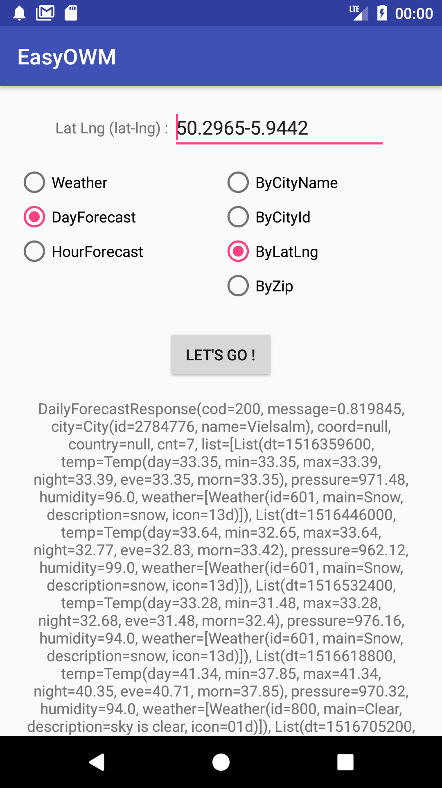

# EasyOWM for Android

This library allows you to get infos from OpenWeatherMap API.<br />

You can get information about :
- Current weather data (by city name, city id, lat and lon or zip)
- 5 day / 3 hour forecast (by city name, city id, lat and lon or zip)
- 16 day / daily forecast (by city name, city id, lat and lon or zip + cnt)



## Getting Started

```
// API KEY (mandatory), LANG (OPTIONAL) "en" by default, UNITS (OPTIONAL) "imperial" by default

val openWeatherMapApi: OpenWeatherMap(OkHttpClient(), "82eff2c845841c89c837d4e125613d83")

```
# Current weather data 
```
openWeatherMapApi.getCurrentWeatherByCityName("Brussel", object : OpenWeatherMapCallback<CurrentWeatherResponse>(){
    override fun success(response: CurrentWeatherResponse) {
        Log.i("Success", response.toString());
    }

    override fun failure(message: String) {
        Log.i("Failure", message);
    }
})
```
# 5 day / 3 hour forecast
```
openWeatherMapApi.getHourForecastByCityName("Brussel", object : OpenWeatherMapCallback<HourForecastResponse>(){
    override fun success(response: HourForecastResponse) {
        Log.i("Success", response.toString());
    }

    override fun failure(message: String) {
        Log.i("Failure", message);
    }
})
```
# 16 day / daily forecast
// Note : "16" is cnt (optional) "7" by default 
```
openWeatherMapApi.getDailyForecastByCityName("Brussel", object : OpenWeatherMapCallback<DailyForecastResponse>(){
    override fun success(response: DailyForecastResponse) {
        Log.i("Success", response.toString());
    }

    override fun failure(message: String) {
        Log.i("Failure", message);
    }
}, "16")
```

## Installation
AndroidManifest.xml

```
<uses-permission android:name="android.permission.INTERNET" />
```
Gradle Project
 
```
buildscript {
    repositories {
        maven { url 'https://jitpack.io' }
    }
}
```
Gradle App
 
```
 implementation 'com.github.sokarcreative:easyowm:1.1'
```

## API Reference

OpenWeatherMap API : http://openweathermap.org/api

License
============

Copyright (C) 2017 sokarcreative
 
Licensed under the Apache License, Version 2.0 (the "License");
you may not use this file except in compliance with the License.
You may obtain a copy of the License at

http://www.apache.org/licenses/LICENSE-2.0
 
Unless required by applicable law or agreed to in writing, software
distributed under the License is distributed on an "AS IS" BASIS,
WITHOUT WARRANTIES OR CONDITIONS OF ANY KIND, either express or implied.
See the License for the specific language governing permissions and
limitations under the License.
